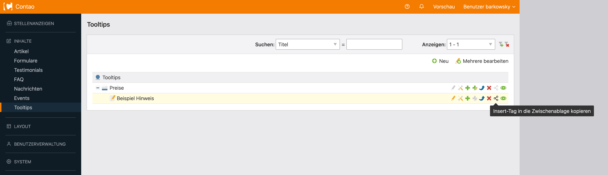
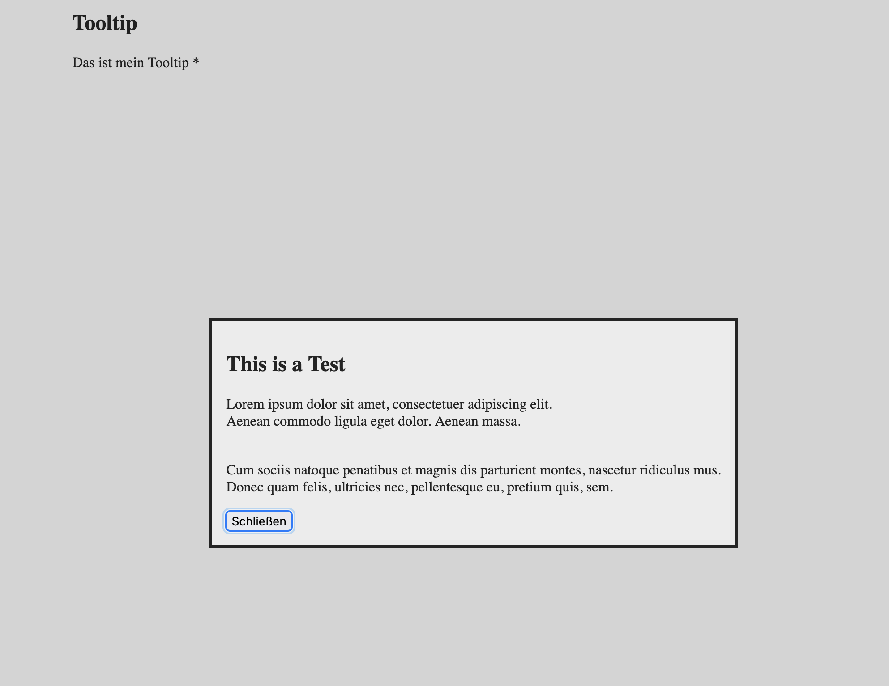

# Contao Modal / Dialog / Tooltip  / Overlay

Easy way to get editor friendly additional information as a tooltip/modal, popup/dialog or overlay.  
Add tooltips/modal/dialog/overlay next to a lot of elements.  

Elements will be loaded by ajax.


Copy generated insert tag directly from source to clipboard to put it where ever you want.

Example: ```{{plenta_tooltip::alias}}```

## Installation

### Install using Contao Manager

Search for **tooltip**, **dialog** or **modal** and you will find this extension.

### Install using Composer

```bash
composer require plenta/contao-tooltip-bundle
```

## System requirements

- PHP: `^8.0`
- Contao: `^4.13 || ^5.3` (later for Contao 5)

## Settings
### Modal Popup Width Configuration
Choose from a variety of predefined max-width settings available in the tooltip options. Additionally, you have the flexibility to incorporate custom sizes by adjusting the `config.yml` file.
```yaml
# Predefined <dialog> sizes
plenta_tooltip:
    tooltip_sizes:
        small:
            cssClass: tooltip-small
        medium:
            cssClass: tooltip-medium
        large:
            cssClass: tooltip-large
```
Each predefined tooltip size corresponds to a specific CSS custom property, offering a seamless integration into your design.
```scss
:root {
    --plenta-tooltip-max-width-large: 1280px;
    --plenta-tooltip-max-width-medium: 680px;
    --plenta-tooltip-max-width-small: 380px;
    --plenta-tooltip-max-width-default: var(--plenta-tooltip-max-width-medium);
}
```

## Resources Integration
To effortlessly incorporate the plugin into your project, minimal CSS and JavaScript files are supplied. These files are loaded during the insert tag replacement process. The CSS file appends its styles to the `$GLOBALS['TL_CSS']['plenta_tooltip']` variable, while the JavaScript file appends its code to the `$GLOBALS['TL_BODY']['plenta_tooltip_js']` variable.



